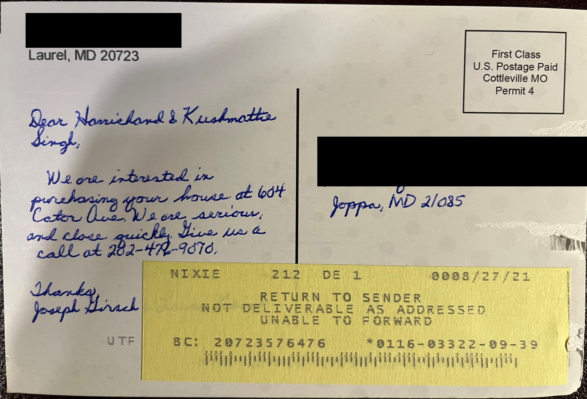

# Baltimore_Citations_Scraper script explanation

### Introduction
Welcome to the Baltimore Citations Web Scraper. This project was conceived as an optimization tool for a 6-month marketing campaign for the real estate investor wholesaling business that my partner and I conducted from September 2021 to February 2022. In summary, we wanted to identify damaged, neglected, or otherwise problem properties and give their owners an offer to purchase the property via a purchase contract that we could then assign for a fee to a house flipper looking for their next renovation project. The City of Baltimore routinely writes up citation notices for properties that have visible signs of neglect and makes them publicly searchable online. We came up with the idea of building a web scraper to gather these records for us to help us narrow our marketing campaign to identify property owners that would be most interested in our services. The "baltimore_citations_scraper.py" script accomplishes this task by using a web scraper to gather these records for us automatically. 

### Installation Instructions
Most of the Python packages used are fairly common and are loaded with Anaconda by default (pandas, numpy, time, datetime). But you may need to "conda install package_name" (or pip install) BeautifulSoup, selenium, and webdriver_manager. The most up to date packages are fine. 
Update: The scraper uses the Google Chrome browser so you will need to have that installed as well, if you haven't already. It is possible to configure the code to use other browsers like FireFox, if desired.  

### Directions
Once you clone the repository and confirmed all the required packages are installed, you should be able simply run "baltimore_citations_scraper.py" without any additional input from the user. Once run the script, you will see a Google Chrome browser open https://cels.baltimorehousing.org/Search_On_Map.aspx and begin cycling through the neighborhood data on its own. This is the expected behavior of the script. Once the scraper completes, it will store the raw citation data in the "BaltimoreCity_Citations_Raw_Temp" folder and the processed data to the "BaltimoreCity_Citations_Processed" folder. Note that a sample excel file is included in each of these folders to start with to show the user what format to expect. Don't run multiple scrapers at the same time as they tend to not play nice with each other. 

By default, only the first 10 neighborhoods are scrapped. To scrape every neighborhood, open the "baltimore_citations_scraper_functions.py" and go to this code line: `for city in cities[0:10]:` in the "baltimore_city_scraper()" function, delete the `[0:10]` piece of this code so that the line says `for city in cities:`, save and close the file, and then rerun the "baltimore_citations_scraper.py" script. Note that there are over 300 hundred neighborhoods in Baltimore City and will take over 45 minutes to scrape the property citations from all of them. 

### List of Files
List of Python Files:
* "baltimore_citations_scraper.py": This is the main scraper script that you will run to scrape Baltimore City's Citation records and the follow on processing. This script only has about a dozen lines of code as it has modularized most of the functionality into functions which are stored in "baltimore_citations_scraper_functions.py"
* "baltimore_citations_scraper_functions.py": This file stores the functions that will be imported and used by "baltimore_citations_scraper.py" The functions in this file are baltimore_city_scraper(), validAddressRows(), recentDaysFilter(), countDiffDayDuplicates(), and processCitations_only(). 

List of Folders:
* "BaltimoreCity_Citations_Raw_Temp": This folder acts stores the raw scraped citation data here as a single excel file. This file is not used in the script but is kept for debugging purposes.
* "BaltimoreCity_Citations_Processed": This folder stores the processed citations here, also as an excel file.  Note that this file will contain significantly fewer rows than the excel file in the "BaltimoreCity_Citations_Raw_Temp" folder as we intentionally dropped citations that contained errors in the Address column, were older than 180 days, and properties that were only mailed a single time. My partner and I used the remaining property addresses for our wholesaling mailing campaign.

### Important Lessons Learned
1. In consultation with our prior research and with real estate investors in the area, we found that owners of properties that received multiple recent citation notifications were the most open to the prospect of selling their property to an investor. To accomodate this insight, we filtered the scraped citation data to only include properties that received at least 2 citations within the last 6 months. 
2. We also improved our marketing materials significantly over the course of the 6-month marketing campaign. Initially we sent out mailing materials that used printed text before outsourcing our mailing to BallPointMarketing. Hiring BallPointMarketing's services for their custom handwritten letters and postcards increased our cost by about 50%, but we nearly doubled our response rate. Some samples of the mailers we sent out are shown below. 

